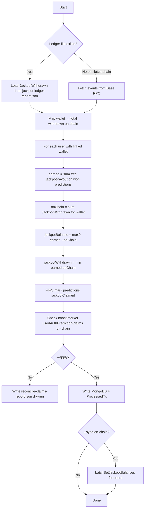
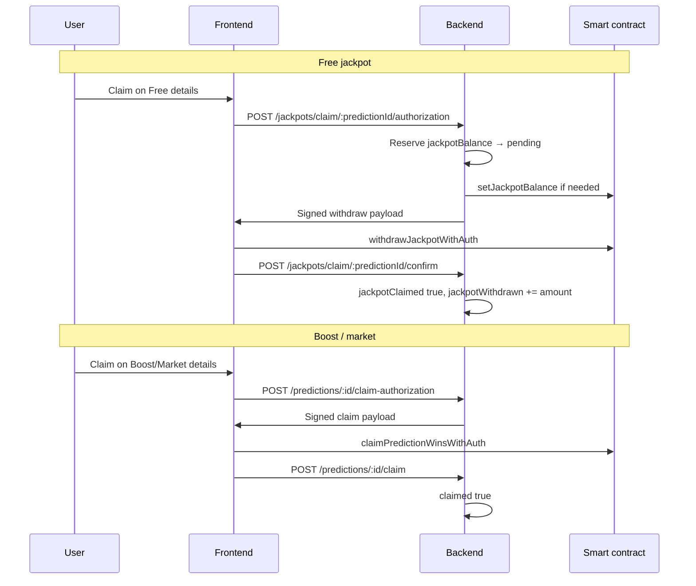

# Claim reconciliation guide

> **Full platform security & claim flows:** see [`../SECURITY.md`](../SECURITY.md).

This document explains how to align **MongoDB** claim balances with **on-chain** reality so existing users can claim **free jackpot**, **boost**, and **market** wins after the security hardening.

---

## Why reconciliation is needed

Before the security update, the platform had a gap between what happened on-chain and what was stored in the database:

| Problem | Effect |
|--------|--------|
| Jackpot withdraw signed without debiting DB | User could withdraw on-chain; `jackpotWithdrawn` stayed `0` |
| `/jackpots/withdraw` confirm sometimes skipped | Chain paid USDC; DB still showed full `jackpotBalance` |
| Bulk withdraw (not per-prediction) | No `jackpotClaimed` per free win |
| Boost/market claim on-chain but DB not updated | `claimed: false` in DB while contract already paid |

**Result:** ~$1,577 left the jackpot pool on-chain while DB only recorded ~$474 withdrawn. Some wallets withdrew far more than their recorded wins.

The new claim flow fixes this going forward. **Reconciliation fixes historical data once** so claims work correctly for everyone who still has a legitimate balance.

---

## Files involved

| File | Purpose |
|------|---------|
| `scripts/reconcileClaimsFromChain.js` | Main reconciliation script |
| `scripts/fetchJackpotLedger.js` | Builds on-chain jackpot in/out ledger |
| `jackpot-ledger-report.json` | Cached `JackpotWithdrawn` events (default input) |
| `reconcile-claims-report.json` | Output after each dry-run or apply |
| `scripts/jackpotDbReconcile.js` | Read-only DB vs chain summary (no writes) |

---

## High-level flow



---

## Free jackpot reconciliation

### Source of truth

| Field | Source |
|-------|--------|
| **Earned** | MongoDB: `sum(prediction.jackpotPayout)` for `type: free`, `status: won` |
| **Withdrawn** | On-chain: sum of `JackpotWithdrawn` events for the user’s linked wallet |
| **Available** | `earned − withdrawn` (never negative) |

### Formulas applied per user

```
correctWithdrawn = min(earned, onChainWithdrawn)
correctBalance   = max(0, earned - onChainWithdrawn)
```

### Per-prediction `jackpotClaimed` (FIFO)

Withdrawn amount is applied to free wins **oldest first**:

1. Sort won free predictions by `createdAt`.
2. For each prediction, if remaining withdrawn ≥ `jackpotPayout` → `jackpotClaimed: true`.
3. Stop when withdrawn amount is used up.

This matches how users historically used **bulk withdraw** (one chain tx for a total, not per event).

### Over-withdrawn wallets

If `onChainWithdrawn > earned`:

- User took more USDC on-chain than DB says they won.
- Script sets `jackpotBalance = 0`, `jackpotWithdrawn = earned`.
- All their free wins are marked `jackpotClaimed: true`.
- Report flags `"overWithdrawnOnChain": true` — review these manually.

### Other cleanups

- `jackpotBalancePending` → `0`
- `jackpotWithdrawInProgress` → `false`
- Historical withdraw `txHash` values → registered in `ProcessedTx` (scope `jackpot_withdraw`) so confirm cannot double-count

---

## Boost and market reconciliation

Boost and market use a **shared claim pool** (`claimPredictionWinsPool`), not the jackpot pool.

For each prediction where:

- `type` is `boost` or `market`
- `status` is `settled`
- `payout > 0`
- `claimed` is not `true`

…the script reads the contract:

| Channel | On-chain check |
|---------|----------------|
| Boost / AMM market | `usedAuthPredictionClaims(authKey)` |
| Orderbook market | `usedOrderbookClaimKeys(authKey)` |

Where:

```
predictionId = keccak256(utf8(mongoPredictionId))
authKey (boost/AMM)  = keccak256(abi.encodePacked(wallet, predictionId))
authKey (orderbook)  = keccak256(abi.encodePacked(wallet, predictionId, 2))
```

If the key is already used on-chain → set `claimed: true` in MongoDB.

No balance fields change for boost/market; only the claim flag is repaired.

---

## How to run

All commands from the `backend` folder.

### 1. Refresh on-chain ledger (recommended)

```bash
node scripts/fetchJackpotLedger.js
```

Creates/updates `jackpot-ledger-report.json`.

### 2. Dry-run (safe — no DB changes)

```bash
npm run reconcile:claims
# or
node scripts/reconcileClaimsFromChain.js
```

Reads the ledger, computes all changes, writes **`reconcile-claims-report.json`**. Review this before applying.

### 3. Apply to MongoDB

```bash
npm run reconcile:claims:apply
# or
node scripts/reconcileClaimsFromChain.js --apply
```

### 4. Apply + sync on-chain `jackpotBalances` (optional)

Requires `SETTLEMENT_RELAY_PRIVATE_KEY` and that wallet is **admin** on the contract.

```bash
npm run reconcile:claims:apply:sync
# or
node scripts/reconcileClaimsFromChain.js --apply --sync-on-chain
```

Use this **after** you deploy the hardened contract that enforces `jackpotBalances[user]` on withdraw. On the **current** production contract, on-chain sync is optional; DB reconciliation is what unblocks the new per-prediction claim API.

### Force live RPC instead of ledger file

```bash
node scripts/reconcileClaimsFromChain.js --fetch-chain
```

---

## Reading the report

Open `reconcile-claims-report.json` after a dry-run.

### Summary section

```json
{
  "jackpotUsersAdjusted": 93,
  "jackpotPredictionsUpdated": 359,
  "boostMarketPredictionsMarkedClaimed": 2,
  "jackpotProcessedTxToRegister": 1052,
  "walletsOverWithdrawnOnChain": 25
}
```

| Field | Meaning |
|-------|---------|
| `jackpotUsersAdjusted` | Users whose `jackpotBalance` / `jackpotWithdrawn` will change |
| `jackpotPredictionsUpdated` | Free predictions getting `jackpotClaimed` updated |
| `boostMarketPredictionsMarkedClaimed` | Boost/market rows marked claimed from chain |
| `jackpotProcessedTxToRegister` | Historical txs added to idempotency table |
| `walletsOverWithdrawnOnChain` | Users who withdrew more on-chain than earned |

### Per-user row (`jackpotUsers`)

```json
{
  "userId": "...",
  "username": "ThePredictor",
  "wallet": "0x7f10...",
  "earned": 2.000257,
  "onChainWithdrawn": 12.729532,
  "overWithdrawnOnChain": true,
  "before": { "jackpotBalance": 1.13, "jackpotWithdrawn": 7.53 },
  "after":  { "jackpotBalance": 0, "jackpotWithdrawn": 2.00 },
  "predictionsMarkedClaimed": 3
}
```

### Legitimate unclaimed user (after reconcile)

A user who **won but never withdrew** should look like:

- `onChainWithdrawn`: `0`
- `after.jackpotBalance`: equals `earned`
- `predictionsMarkedUnclaimed`: wins still open for claim on Free details

Users with **no changes** may not appear in `jackpotUsers` — that means DB already matched the formulas.

---

## After reconciliation

1. **Review** `overWithdrawnOnChain` rows — these users should not receive more jackpot USDC.
2. **Fund** `jackpotPool` on the contract so remaining legitimate balances can be paid (~$200 USDC was estimated from prior analysis; re-check `jackpot-db-reconcile.json`).
3. **Deploy** the hardened contract when ready; update `CONTRACT_ADDRESS` and ABIs.
4. **New claims** use:
   - Free: claim button on event **Free details** → `POST /jackpots/claim/:predictionId/authorization`
   - Boost/market: claim on event page → `POST /predictions/:id/claim-authorization`

---

## User claim flow (post-fix)



Reconciliation prepares the DB **before** this flow so balances and flags match what already happened on-chain.

---

## Admin pools vs on-chain USDC pools (important)

These are **two different things** — removing legacy user claim functions does **not** affect admin pool management.

| What | Where | How admin changes it |
|------|--------|----------------------|
| **Event jackpot / boost pool** | MongoDB (`freeJackpotPool`, `boostPool` on match/poll) | Admin UI → Add/Subtract (API only). Used at **resolve** to calculate winner shares. |
| **On-chain USDC vault** | Smart contract (`jackpotPool`, `claimPredictionWinsPool`) | Deployer/superAdmin calls `fundJackpotPool()` / `fundClaimPredictionWinsPool()` with USDC. Required so users can **receive** USDC when they claim. |
| **Per-user claim cap (jackpot)** | On-chain `jackpotBalances[user]` | Settlement wallet (admin) calls `setJackpotBalance` / `batchSetJackpotBalances` after resolve or reconciliation. |

**User claims always use signed auth:**

- Free jackpot → `withdrawJackpotWithAuth` (backend signs)
- Boost / market → `claimPredictionWinsWithAuth` or `claimOrderbookPositionWithAuth`

**Removed from contract (security):** unsigned `withdrawJackpot()`, `claimPredictionWins()`, `claimBoost()`. Users cannot bypass the backend by calling Basescan directly.

**Still on contract (unchanged):** `fundJackpotPool`, `fundClaimPredictionWinsPool`, `setJackpotBalance`, `batchSetJackpotBalances`, `setClaimableBoost`, `setClaimableMarket`.

---

## Confirm endpoint verification (new)

After a successful on-chain tx, confirm endpoints require `txHash` and verify the receipt contains the expected event:

- Jackpot: `JackpotWithdrawn(user, amount)`
- Boost/market: `PredictionWinsClaimed` or `OrderbookPositionClaimed`

If confirm fails after chain success, wait and retry — the frontend retries automatically. Stale jackpot reservations scan recent chain events before refunding pending balance.

---

| Command | Writes DB? |
|---------|------------|
| `node scripts/jackpotDbReconcile.js` | No — summary only |
| `node scripts/fetchJackpotLedger.js` | No — ledger JSON only |
| `node scripts/reconcileClaimsFromChain.js` | No (dry-run) |
| `node scripts/reconcileClaimsFromChain.js --apply` | **Yes** |

---

## Environment variables

| Variable | Required for |
|----------|----------------|
| `MONGODB_URI` | All reconciliation |
| `CONTRACT_ADDRESS` | Chain reads / sync |
| `BASE_READ_RPC_URL` | Live fetch (`--fetch-chain`) |
| `SETTLEMENT_RELAY_PRIVATE_KEY` | `--sync-on-chain` only |

---

## FAQ

**Q: Will this send USDC to users?**  
No. It only updates MongoDB (and optionally on-chain **balance mapping**, not transfers).

**Q: Can I run dry-run multiple times?**  
Yes. Safe to repeat until you are happy with the report.

**Q: What if a user already claimed on-chain but reconciliation marks predictions unclaimed?**  
FIFO only marks claimed while withdrawn amount covers each win. Partial bulk withdraws may leave newer wins unclaimed — correct for the new per-prediction claim flow.

**Q: Do I need reconciliation after every resolve?**  
No. This is a **one-time** historical fix. New resolves use `deferJackpotOnChainSync` automatically.
